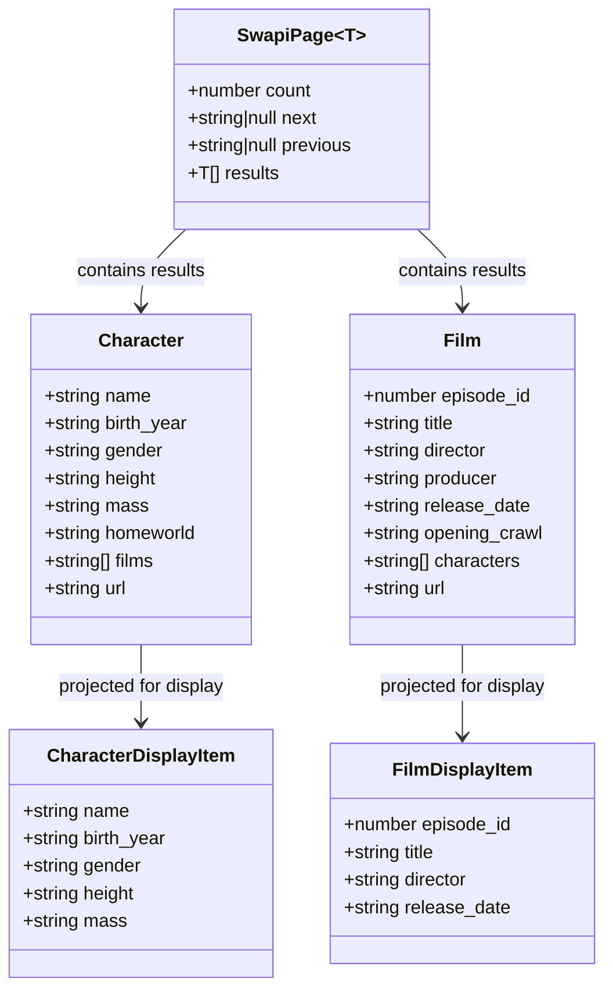

# Angular 17 Star Wars SPA — Characters & Films Listing

## Requirements

Implement a standalone Angular 17 single-page application that presents Star Wars data to users through two distinct, route-based screens — one listing characters and one listing films — consuming the public SWAPI REST API, rendered with Angular Material components, and optimised to meet Core Web Vitals thresholds (LCP, CLS, INP).

Scope boundaries:
- Two listing screens only (`/characters`, `/films`); no detail pages.
- Read-only data from SWAPI; no authentication, no local persistence.
- All UI via Angular Material v17; no additional UI frameworks.
- Greenfield project — no existing Angular workspace, no legacy code to migrate.

---

## Entities



- **`SwapiPage<T>`** is the generic pagination envelope returned by every SWAPI list endpoint.
- **`Character`** and **`Film`** are the raw API response shapes — defined as TypeScript interfaces, not classes, to keep them as plain data contracts.
- **`CharacterDisplayItem`** and **`FilmDisplayItem`** are view-layer projections: only the fields rendered in the template are included, reducing coupling to the raw API shape.

---

## Approach

1. **Project Scaffolding**:
   - Generate an Angular 17 workspace using Angular CLI v17 with `--standalone` as the default component style (`ng new --standalone`).
   - Add Angular Material v17 via `ng add @angular/material`, selecting a prebuilt theme (Indigo/Pink), global typography, and browser animations.
   - Enable TypeScript strict mode in `tsconfig.json`.

2. **Routing Architecture**:
   - Define routes in `app.routes.ts` using Angular's standalone `Routes` type.
   - Both `CharactersComponent` and `FilmsComponent` are lazy-loaded via `loadComponent(() => import(...))` to minimise the initial bundle (LCP optimisation).
   - Add a catch-all redirect from `''` to `'/characters'` as the default landing route.
   - Bootstrap the application in `main.ts` using `bootstrapApplication(AppComponent, { providers: [provideRouter(routes)] })`.

3. **Data Access Layer**:
   - Implement a single `SwapiService` (injectable `{ providedIn: 'root' }`) using Angular's `HttpClient`.
   - Expose `getCharacters(page: number): Observable<SwapiPage<Character>>` and `getFilms(): Observable<SwapiPage<Film>>`.
   - Apply `shareReplay(1)` on the films observable (static dataset, safe to cache in memory) to avoid duplicate HTTP requests on re-navigation.
   - Place the SWAPI base URL in `src/environments/environment.ts` as `apiUrl: 'https://swapi.dev/api'`.
   - Provide `HttpClient` globally via `provideHttpClient(withFetch())` in `bootstrapApplication` providers — `withFetch()` enables the Fetch API backend for improved SSR-readiness and smaller polyfills.

4. **Component & UI Design**:
   - `AppComponent`: shell component with `MatToolbar` as the top navigation bar containing `routerLink` anchors to `/characters` and `/films`, and a `<router-outlet>` below.
   - `CharactersComponent`: displays a `MatList` of `CharacterDisplayItem` entries. Uses `MatPaginator` to navigate SWAPI's server-side pagination (10 items/page, ~82 total). Shows `MatProgressSpinner` inside a fixed-height container while loading.
   - `FilmsComponent`: displays `MatCard` components for each film (6 films total, no pagination needed). Shows `MatProgressSpinner` while loading.
   - Both listing components use `ChangeDetectionStrategy.OnPush` and consume data exclusively via the `async` pipe.

5. **Core Web Vitals Strategy**:
   - **LCP**: Lazy-loaded routes reduce initial JS parse/eval time. The largest paint candidate (the list) is rendered as soon as the HTTP response arrives; no deferred images.
   - **CLS**: Loading containers have a fixed `min-height` so the spinner occupies the same vertical space as the content list, preventing reflow when data arrives. `MatPaginator` is always rendered (hidden via `*ngIf` only on films screen) to prevent layout shifts.
   - **INP**: `OnPush` change detection limits DOM reconciliation to explicit input/output events. Angular Material components are individually tree-shaken (no bulk Material module imports).

6. **Error Handling**:
   - Each component catches HTTP errors via `catchError` in the service and surfaces a user-visible error message using `MatSnackBar` or an inline `mat-error` area. The application must not silently fail or display an empty list when SWAPI is unreachable.

---

## Structure

### Component & Service Hierarchy
1. `AppComponent` — standalone shell; imports `MatToolbar`, `RouterLink`, `RouterOutlet`
2. `CharactersComponent` — standalone listing; imports `MatList`, `MatListItem`, `MatPaginator`, `MatProgressSpinner`, `AsyncPipe`, `NgIf`
3. `FilmsComponent` — standalone listing; imports `MatCard`, `MatCardHeader`, `MatCardContent`, `MatProgressSpinner`, `AsyncPipe`, `NgIf`
4. `SwapiService` — injectable service; depends on `HttpClient`

### Dependencies
1. `AppComponent` declares routes via `provideRouter(routes)` in `bootstrapApplication`
2. `CharactersComponent` injects `SwapiService` and calls `getCharacters(page)`
3. `FilmsComponent` injects `SwapiService` and calls `getFilms()`
4. `SwapiService` injects `HttpClient` and reads `environment.apiUrl`

### File Layout
```
src/
├── main.ts                          # bootstrapApplication entry point
├── app/
│   ├── app.component.ts             # Shell — toolbar + router-outlet
│   ├── app.component.html
│   ├── app.routes.ts                # Route definitions (lazy loadComponent)
│   ├── features/
│   │   ├── characters/
│   │   │   ├── characters.component.ts
│   │   │   └── characters.component.html
│   │   └── films/
│   │       ├── films.component.ts
│   │       └── films.component.html
│   ├── core/
│   │   └── services/
│   │       └── swapi.service.ts
│   └── models/
│       ├── character.model.ts
│       ├── film.model.ts
│       └── swapi-page.model.ts
└── environments/
    └── environment.ts
```

### Layered Architecture
1. **Presentation Layer** (`AppComponent`, `CharactersComponent`, `FilmsComponent`): Responsible for rendering Angular Material UI, handling user interaction (pagination), and delegating all data fetching to the service layer via observables.
2. **Service Layer** (`SwapiService`): Responsible for all HTTP communication with SWAPI, response typing, pagination URL construction, and in-memory caching via `shareReplay`.
3. **Model Layer** (`models/`): TypeScript interfaces defining the SWAPI API contract boundary — `Character`, `Film`, `SwapiPage<T>`.
4. **Configuration Layer** (`environments/`): Externalises the SWAPI base URL so it can be overridden per environment without code changes.

---

## Operations

### Create Model Interfaces

**File: `src/app/models/swapi-page.model.ts`**
1. Export interface `SwapiPage<T>` with fields: `count: number`, `next: string | null`, `previous: string | null`, `results: T[]`.

**File: `src/app/models/character.model.ts`**
1. Export interface `Character` with fields: `name: string`, `birth_year: string`, `gender: string`, `height: string`, `mass: string`, `homeworld: string`, `films: string[]`, `url: string`.
2. Export interface `CharacterDisplayItem` with fields: `name: string`, `birth_year: string`, `gender: string`, `height: string`, `mass: string`.
3. Export function `toCharacterDisplayItem(c: Character): CharacterDisplayItem` that maps the five display fields from the raw API response.

**File: `src/app/models/film.model.ts`**
1. Export interface `Film` with fields: `episode_id: number`, `title: string`, `director: string`, `producer: string`, `release_date: string`, `opening_crawl: string`, `characters: string[]`, `url: string`.
2. Export interface `FilmDisplayItem` with fields: `episode_id: number`, `title: string`, `director: string`, `release_date: string`.
3. Export function `toFilmDisplayItem(f: Film): FilmDisplayItem` that maps the four display fields.

---

### Create `environment.ts`

**File: `src/environments/environment.ts`**
1. Export constant `environment` object with property `apiUrl: 'https://swapi.dev/api'`.

---

### Create `SwapiService`

**File: `src/app/core/services/swapi.service.ts`**

1. Annotate with `@Injectable({ providedIn: 'root' })`.
2. Inject `HttpClient` via constructor injection.
3. Declare private readonly `apiUrl = environment.apiUrl`.
4. Implement `getCharacters(page: number = 1): Observable<SwapiPage<Character>>`:
   - Logic: perform `this.http.get<SwapiPage<Character>>(\`${this.apiUrl}/people/?page=${page}\`)`.
   - Return the raw Observable; do NOT apply `shareReplay` here (paginated, per-page cache not needed at service level — each component page navigation fetches fresh data).
   - Apply `catchError` — re-throw as an `Error` with message `'Failed to load characters'`.
5. Implement `getFilms(): Observable<SwapiPage<Film>>`:
   - Logic: perform `this.http.get<SwapiPage<Film>>(\`${this.apiUrl}/films/\`)`.
   - Apply `shareReplay(1)` — films are static (~6 total), safe to cache across navigations.
   - Map results to apply `toFilmDisplayItem` on each film.
   - Apply `catchError` — re-throw as `Error` with message `'Failed to load films'`.
6. Declare a private `filmsCache$` property that stores the `shareReplay(1)` observable, initialized lazily on first `getFilms()` call.

---

### Create `AppComponent`

**File: `src/app/app.component.ts`**

1. Decorate with `@Component({ selector: 'app-root', standalone: true, changeDetection: ChangeDetectionStrategy.OnPush, imports: [MatToolbarModule, MatButtonModule, RouterLink, RouterOutlet] })`.
2. Template (`app.component.html`):
   - `<mat-toolbar color="primary">` containing the app title "Star Wars" and two `<a mat-button routerLink="/characters">Personagens</a>` and `<a mat-button routerLink="/films">Filmes</a>` navigation links.
   - `<router-outlet>` below the toolbar.
3. Apply `routerLinkActive="active"` on each navigation link with an `.active` CSS class that adds an underline indicator.

---

### Create `app.routes.ts`

**File: `src/app/app.routes.ts`**

1. Export `Routes` constant named `routes`:
   ```
   { path: 'characters', loadComponent: () => import('./features/characters/characters.component').then(m => m.CharactersComponent) }
   { path: 'films',      loadComponent: () => import('./features/films/films.component').then(m => m.FilmsComponent) }
   { path: '',           redirectTo: 'characters', pathMatch: 'full' }
   { path: '**',         redirectTo: 'characters' }
   ```

---

### Configure `main.ts`

**File: `src/main.ts`**

1. Call `bootstrapApplication(AppComponent, { providers: [ provideRouter(routes, withComponentInputBinding()), provideHttpClient(withFetch()), provideAnimations() ] })`.
2. Import `provideRouter` and `withComponentInputBinding` from `@angular/router`.
3. Import `provideHttpClient` and `withFetch` from `@angular/common/http`.
4. Import `provideAnimations` from `@angular/platform-browser/animations`.

---

### Create `CharactersComponent`

**File: `src/app/features/characters/characters.component.ts`**

1. Decorate with `@Component({ standalone: true, changeDetection: ChangeDetectionStrategy.OnPush, imports: [AsyncPipe, NgIf, MatListModule, MatPaginatorModule, MatProgressSpinnerModule] })`.
2. Inject `SwapiService`.
3. Declare `currentPage = signal(1)` (Angular 17 signal for reactive page tracking).
4. Declare `characters$ = computed(() => this.swapiService.getCharacters(this.currentPage()))` — reacts automatically to page changes.
5. Declare `totalCount$: Observable<number>` — derived from the same HTTP call as `characters$`; OR alternatively, fetch as part of the same stream and use `map` to extract `count`.
   - Simpler approach: use a single `pageData$: Observable<SwapiPage<Character>>` observable that re-fetches when `currentPage` changes. Use `toObservable(this.currentPage).pipe(switchMap(page => this.swapiService.getCharacters(page)))`.
6. Declare `isLoading$` using `pageData$.pipe(map(() => false), startWith(true))` to drive the spinner.
7. Implement `onPageChange(event: PageEvent)`: update `currentPage.set(event.pageIndex + 1)`.
8. Template (`characters.component.html`):
   - Fixed-height container `div` with `min-height: 600px` to prevent CLS.
   - `*ngIf="isLoading$ | async"` block: `<mat-spinner>` centred in the container.
   - `*ngIf="!(isLoading$ | async)"` block: `<mat-list>` with `*ngFor` over `(pageData$ | async)?.results`, displaying `mat-list-item` with character name, birth year, and gender.
   - `<mat-paginator [length]="(pageData$ | async)?.count" [pageSize]="10" (page)="onPageChange($event)">`.
   - Error state: `*ngIf="error$ | async as error"` renders a `<p class="error-message">{{ error }}</p>` with retry button.
9. Declare `error$` observable that catches errors from `pageData$` using `catchError(err => of({ error: err.message }))` — discriminated union pattern.

---

### Create `FilmsComponent`

**File: `src/app/features/films/films.component.ts`**

1. Decorate with `@Component({ standalone: true, changeDetection: ChangeDetectionStrategy.OnPush, imports: [AsyncPipe, NgIf, NgFor, MatCardModule, MatProgressSpinnerModule] })`.
2. Inject `SwapiService`.
3. Declare `films$ = this.swapiService.getFilms().pipe(map(page => page.results.map(toFilmDisplayItem)), shareReplay(1))`.
4. Declare `isLoading$` using `films$.pipe(map(() => false), startWith(true))`.
5. Declare `error$` observable catching errors from `films$`.
6. Template (`films.component.html`):
   - Fixed-height container with `min-height: 400px`.
   - Spinner block while `isLoading$ | async` is true.
   - `<div class="films-grid">` containing `*ngFor` over `films$ | async`, rendering one `<mat-card>` per film.
   - `mat-card` layout: `<mat-card-header>` with episode number and title; `<mat-card-content>` with director and release date.
   - Error state block analogous to `CharactersComponent`.

---

### Configure Styles & CWV Utilities

**File: `src/styles.scss`**

1. Import Angular Material prebuilt theme: `@use '@angular/material' as mat;` with Indigo/Pink theme via `mat.all-component-themes()`.
2. Set `html, body { height: 100%; margin: 0; font-family: Roboto, sans-serif; }`.
3. Define `.films-grid { display: grid; grid-template-columns: repeat(auto-fill, minmax(300px, 1fr)); gap: 16px; padding: 16px; }`.
4. Define `.loading-container { display: flex; justify-content: center; align-items: center; }` with fixed `min-height` applied via component-level styles.
5. Define `.active { border-bottom: 2px solid white; }` for active router-link indicator.

---

## Norms

1. **Standalone-only architecture**: No `NgModule` declarations anywhere. Every component, directive, and pipe uses `standalone: true`. Application bootstrapped exclusively via `bootstrapApplication`.

2. **Change detection**: Every component must declare `changeDetection: ChangeDetectionStrategy.OnPush`. No component may rely on default (zone-based dirty-checking) change detection.

3. **Observable subscriptions**: All component templates consume observables exclusively via the `async` pipe. No manual `subscribe()` calls in component TypeScript — no subscription teardown boilerplate required as a result.

4. **Angular Material imports**: Each standalone component imports only the specific Angular Material module(s) it uses (e.g., `MatListModule`, not a blanket `MaterialModule`). This enables tree-shaking and reduces per-route bundle size.

5. **TypeScript strict mode**: `tsconfig.json` must have `"strict": true`. All function parameters and return types must be explicitly typed. No `any` allowed except at HTTP boundary where the generic type parameter handles typing.

6. **Environment configuration**: All URLs, API keys, and environment-specific values must be read from `src/environments/environment.ts`. No hardcoded URLs in service or component files.

7. **Error handling**: Every HTTP observable in `SwapiService` must apply `catchError`. Components must expose an `error$` observable and display a visible error message in the template — silent failures are not acceptable.

8. **Naming conventions**:
   - Files: `kebab-case.component.ts`, `kebab-case.service.ts`, `kebab-case.model.ts`
   - Classes: `PascalCase`
   - Observables: suffixed with `$` (e.g., `films$`, `isLoading$`)
   - Signals: no suffix (e.g., `currentPage`)

9. **No state management library**: No NgRx, Akita, or Signal Store. Local component state via Angular signals and RxJS operators is sufficient for this scope.

10. **Accessibility**: All `mat-list-item` elements must have readable text content. `mat-card` titles must be semantic headings (`mat-card-title` maps to `h3` by default in Material). Navigation links must have descriptive `aria-label` if icon-only.

---

## Safeguards

1. **Functional Constraints**:
   - Exactly two named routes must exist: `/characters` and `/films`. No detail routes, no additional routes.
   - The default route (`''`) must redirect to `/characters`.
   - Both routes must be lazy-loaded — eager imports of `CharactersComponent` or `FilmsComponent` in `app.routes.ts` are prohibited.

2. **Performance Constraints (Core Web Vitals)**:
   - **LCP target**: ≤ 2.5 s on a simulated mid-tier mobile device (Lighthouse Mobile preset). Achieved via lazy routes and immediate list render on HTTP response.
   - **CLS target**: ≤ 0.1. All loading containers must have a fixed `min-height` matching the rendered list height. No elements may be injected above existing content.
   - **INP target**: ≤ 200 ms. `OnPush` change detection is mandatory. No synchronous heavy computation in component event handlers.
   - Initial JS bundle (main chunk) must not exceed 200 kB gzipped. Verify with `ng build --stats-json` + `webpack-bundle-analyzer`.

3. **Angular Version Constraints**:
   - Angular CLI, Angular core, Angular Material, and Angular CDK must all be `^17.x.x`. Mixed major versions are not acceptable due to peer dependency breakage.
   - `provideHttpClient(withFetch())` must be used (not the legacy `HttpClientModule`).
   - `provideRouter` must be used (not the legacy `RouterModule.forRoot`).

4. **API Integration Constraints**:
   - All HTTP calls must target `environment.apiUrl` — no hardcoded `https://swapi.dev` strings in service files.
   - HTTP responses must be typed via generics (`http.get<SwapiPage<Character>>`). Untyped `http.get()` calls are prohibited.
   - `SwapiService` is the only file permitted to make `HttpClient` calls. Components must not inject `HttpClient` directly.

5. **Business Rule Constraints**:
   - Characters list must support server-side pagination aligned with SWAPI's page size of 10. `MatPaginator` `pageSize` must be set to 10 and must not be changed by the user (hide page-size selector).
   - Films list must not implement pagination (SWAPI returns all ~6 films in a single response).
   - Clicking a character or film list item must not navigate anywhere (no detail routes in scope).

6. **Error Handling Constraints**:
   - Every HTTP error must result in a visible, non-empty error message in the component template.
   - The application must not throw unhandled exceptions to the browser console on HTTP failure.
   - Error messages must not expose raw HTTP status codes or stack traces to the user — display a friendly message (e.g., "Não foi possível carregar os personagens. Tente novamente.").

7. **Structural Constraints**:
   - No `NgModule` anywhere in the project (including `AppModule`, `BrowserModule` standalone import is allowed).
   - No third-party UI libraries other than Angular Material and Angular CDK.
   - No global state management libraries (NgRx, Akita, etc.).
   - `styles.scss` (not `styles.css`) must be used as the global stylesheet to allow SCSS nesting in component styles.

8. **Data Constraints**:
   - `SwapiPage<T>` interface must match the exact SWAPI response envelope shape (fields: `count`, `next`, `previous`, `results`).
   - `Character` and `Film` interfaces must only declare fields that are actually rendered in the template — unused fields may be omitted from the interface to reduce noise, as long as `count`, `next`, `previous` are preserved in `SwapiPage`.
   - `toCharacterDisplayItem` and `toFilmDisplayItem` mapping functions must be pure functions (no side effects).

9. **API Design Constraints** (component public API):
   - Components must not expose any `@Input()` or `@Output()` — they are routed views, not reusable components.
   - `SwapiService` methods must return `Observable<T>` and never `Promise<T>`.
   - `getFilms()` must always return the same cached observable instance after the first call (enforced by `shareReplay(1)` on the service-level cached stream).
