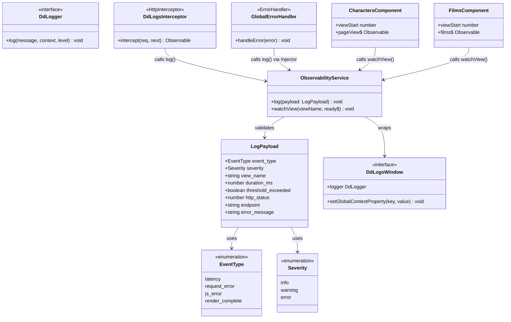

# Angular 17 Datadog Observability Layer — DD_LOGS Structured Logging

## Requirements

Add a production-grade observability layer to the Angular 17 standalone SPA so that every screen render latency, HTTP request failure, and JavaScript error is captured as a structured log event in Datadog Logs (DD_LOGS), enabling a canary-vs-stable comparison dashboard and automatic rollback monitor.

Scope boundaries:
- `window.DD_LOGS` is already initialised by an external Datadog script — do NOT re-initialise it.
- Four event types are captured: `render_complete` / `latency` (screen timing), `request_error` (HTTP failures), `js_error` (Angular zone errors + unhandled promise rejections).
- All logging flows through a single `ObservabilityService` — no other file calls `window.DD_LOGS` directly.
- `app_version` and `deploy_type` are injected at build time and set as global DD_LOGS context once; they must NOT appear in individual log payloads.
- Existing application behaviour (SwapiService caching, component rendering, error display) must be completely unaffected.

---

## Entities



- `LogPayload` is a pure TypeScript interface — all fields optional except `event_type` and `severity`.
- `DdLogsWindow` is an ambient `declare global` extension on `Window` — the only `any`-adjacent type in the codebase.
- `ObservabilityService` is the single consumer of `DdLogsWindow`; all other classes use `ObservabilityService`.
- `GlobalErrorHandler` resolves `ObservabilityService` lazily through `Injector` to prevent circular dependency.

---

## Approach

1. **Central Logging Facade (`ObservabilityService`)**:
   - Single `providedIn: 'root'` service that owns all `window.DD_LOGS` interactions.
   - Constructor runs the global-context setup exactly once (`app_version`, `deploy_type`), guarded by a `window.DD_LOGS` existence check.
   - `log(payload)` maps severity string to DD log level and calls `window.DD_LOGS.logger.log`.
   - `watchView<T>(viewName, ready$: Observable<T | null>)` encapsulates the `performance.now()` start, `filter(non-null)`, `take(1)`, threshold calculation, and `logViewReady` call. Components call this once — zero per-component boilerplate.

2. **HTTP Error Capture (`DdLogsInterceptor`)**:
   - Class-based `HttpInterceptor` placed in `src/app/core/interceptors/`.
   - Taps `catchError` to extract `HttpErrorResponse.status` (or `0` for network/CORS), `req.url`, and `error.message`.
   - Calls `obs.log({ event_type: 'request_error', ... })` then `throwError(() => error)` — the existing `SwapiService.catchError` chain continues unaffected.
   - Registered via `{ provide: HTTP_INTERCEPTORS, useClass: DdLogsInterceptor, multi: true }` + `withInterceptorsFromDi()` added to `provideHttpClient` in `app.config.ts`.

3. **JS Error Capture (`GlobalErrorHandler` + `unhandledrejection`)**:
   - `GlobalErrorHandler` implements Angular's `ErrorHandler` interface; injects `Injector` (not `ObservabilityService` directly) in its constructor to prevent DI ordering issues.
   - `handleError` resolves `ObservabilityService` lazily via `this.injector.get(ObservabilityService)` inside a try-catch that falls back to `console.error` only.
   - `window.addEventListener('unhandledrejection', ...)` is added in `main.ts` after `bootstrapApplication` resolves, using `appRef.injector.get(ObservabilityService)`.
   - Registered via `{ provide: ErrorHandler, useClass: GlobalErrorHandler }` in `app.config.ts`.

4. **Screen Latency Measurement**:
   - Both `CharactersComponent` and `FilmsComponent` depend on async data. `ngAfterViewInit` fires on the spinner skeleton, not on data arrival — latency MUST be measured at first data emission.
   - Pattern: each component stores `private readonly viewStart = performance.now()` as a class field (initialised at construction time), then calls `this.obs.watchView('characters', this.pageView$)` in `ngOnInit`.
   - `watchView` handles the `filter(non-null) → take(1) → logViewReady` subscription internally; the component template observable is untouched.

5. **Build-time Version Injection**:
   - `environment.ts` is extended with `appVersion: '__APP_VERSION__'` and `deployType: '__DEPLOY_TYPE__'`.
   - `angular.json` build options `define` block replaces these string literals at build time: `"__APP_VERSION__": "\"${APP_VERSION}\""`.
   - Default values (`'unknown'` / `'local'`) are used when no CI variables are present, preventing runtime errors during local development.

6. **Test Infrastructure**:
   - Shared JEST mock helper `src/app/core/testing/dd-logs.mock.ts` sets up and tears down `window.DD_LOGS` in `beforeEach` / `afterEach` to prevent cross-test pollution.
   - `performance.now` is mocked with `jest.spyOn(performance, 'now')` in latency-related tests.

---

## Structure

### New Files
1. `src/app/core/types/dd-logs.types.ts` — `LogPayload` interface, `EventType`/`Severity` union types, `DdLogsWindow` ambient global declaration
2. `src/app/core/services/observability.service.ts` — `ObservabilityService` implementation
3. `src/app/core/services/observability.service.spec.ts` — unit tests
4. `src/app/core/interceptors/dd-logs.interceptor.ts` — `DdLogsInterceptor`
5. `src/app/core/interceptors/dd-logs.interceptor.spec.ts` — unit tests
6. `src/app/core/handlers/global-error.handler.ts` — `GlobalErrorHandler`
7. `src/app/core/handlers/global-error.handler.spec.ts` — unit tests
8. `src/app/core/testing/dd-logs.mock.ts` — shared JEST mock helper (excluded from production coverage)

### Modified Files
9. `src/environments/environment.ts` — add `appVersion` and `deployType` with `__PLACEHOLDER__` defaults
10. `src/app/app.config.ts` — add `withInterceptorsFromDi()`, `HTTP_INTERCEPTORS` provider, `ErrorHandler` provider
11. `src/main.ts` — add `unhandledrejection` listener post-bootstrap
12. `src/app/features/characters/characters.component.ts` — inject `ObservabilityService`, add `viewStart`, call `watchView` in `ngOnInit`
13. `src/app/features/films/films.component.ts` — same pattern
14. `angular.json` — add `define` block under `architect.build.options`

### Dependencies
1. `DdLogsInterceptor` → `ObservabilityService` (constructor injection, standard — no circular risk)
2. `GlobalErrorHandler` → `Injector` (constructor injection); resolves `ObservabilityService` lazily inside `handleError`
3. `CharactersComponent` → `ObservabilityService` (constructor injection, standard)
4. `FilmsComponent` → `ObservabilityService` (constructor injection, standard)
5. `ObservabilityService` → `environment` (import, not DI), `window.DD_LOGS` (guarded global access)
6. `main.ts` → `ObservabilityService` via `appRef.injector.get()` post-bootstrap

### Layered Architecture
1. **Ambient Layer** (`dd-logs.types.ts`): Type contracts for `LogPayload`, `EventType`, `Severity`, and `window.DD_LOGS` — no runtime code.
2. **Observability Core** (`ObservabilityService`): Single gateway to Datadog; owns schema enforcement, severity mapping, global context, and latency helper.
3. **Cross-Cutting Interceptors** (`DdLogsInterceptor`): HTTP pipeline — logs request errors as side-effects without altering the data flow.
4. **Error Boundary** (`GlobalErrorHandler`): Angular zone + window promise — catches all unhandled errors, delegates logging to `ObservabilityService`.
5. **View Instrumentation** (`CharactersComponent`, `FilmsComponent`): Minimal additions — each component adds one `viewStart` field and one `watchView()` call; template and data flow unchanged.

---

## Operations

### Create Ambient Type Declarations — `src/app/core/types/dd-logs.types.ts`

1. Define `EventType` as a TypeScript union type: `'latency' | 'request_error' | 'js_error' | 'render_complete'`.
2. Define `Severity` as a union type: `'info' | 'warning' | 'error'`.
3. Define `LogPayload` interface with fields:
   - `event_type: EventType` (required)
   - `severity: Severity` (required)
   - `view_name?: string` (optional)
   - `duration_ms?: number` (optional)
   - `threshold_exceeded?: boolean` (optional)
   - `http_status?: number` (optional)
   - `endpoint?: string` (optional)
   - `error_message?: string` (optional)
4. Define `DdLogsInstance` interface:
   - `setGlobalContextProperty(key: string, value: string): void`
   - `logger: { log(message: string, context: Record<string, unknown>, level: string): void }`
5. Extend the global `Window` interface via `declare global { interface Window { DD_LOGS?: DdLogsInstance } }`.
6. Export `LogPayload`, `EventType`, `Severity`, `DdLogsInstance`. The `declare global` block does not need to be exported.

---

### Update `src/environments/environment.ts`

1. Add two new properties to the exported `environment` object:
   - `appVersion: '__APP_VERSION__'` — replaced at build time by the CI pipeline. Default `'unknown'` if not replaced.
   - `deployType: '__DEPLOY_TYPE__'` — replaced at build time (values: `'stable'` or `'canary'`). Default `'local'` if not replaced.
2. Add a comment above each property:
   - `// TODO(CI): set via ng build --define '__APP_VERSION__="$GIT_SHA"' in the CI pipeline`
   - `// TODO(CI): set via ng build --define '__DEPLOY_TYPE__="canary"' for canary deploys, '"stable"' for stable`

---

### Update `angular.json` — Build-time `define`

1. Locate `projects.starwars-explorer.architect.build.options` in `angular.json`.
2. Add a `define` object:
   ```json
   "define": {
     "__APP_VERSION__": "\"unknown\"",
     "__DEPLOY_TYPE__": "\"local\""
   }
   ```
3. These defaults (`"unknown"`, `"local"`) are used during `ng serve` and `ng build` without CI variable overrides. CI overrides them at build time via `--define '__APP_VERSION__="abc123"'`.

---

### Create `ObservabilityService` — `src/app/core/services/observability.service.ts`

1. Annotate with `@Injectable({ providedIn: 'root' })`.
2. Declare a private constant `LATENCY_THRESHOLD_MS = 5000`.
3. Constructor logic:
   - If `window.DD_LOGS` is undefined, return immediately (early exit — no further setup).
   - Call `window.DD_LOGS.setGlobalContextProperty('app_version', environment.appVersion)`.
   - Call `window.DD_LOGS.setGlobalContextProperty('deploy_type', environment.deployType)`.
4. Implement `log(payload: LogPayload): void`:
   - If `window.DD_LOGS` is undefined, return immediately.
   - Map `payload.severity` to DD level: `'error'` → `'error'`; `'warning'` → `'warn'`; anything else → `'info'`.
   - Call `window.DD_LOGS.logger.log(payload.event_type, { ...payload }, level)`.
5. Implement `watchView<T>(viewName: string, ready$: Observable<T | null>): void`:
   - Record `const start = performance.now()`.
   - Subscribe to `ready$.pipe(filter((v): v is T => v !== null), take(1))`.
   - In the `next` callback: calculate `duration_ms = Math.round(performance.now() - start)`.
   - Determine `exceeded = duration_ms > LATENCY_THRESHOLD_MS`.
   - Call `this.log({ event_type: exceeded ? 'latency' : 'render_complete', severity: exceeded ? 'warning' : 'info', view_name: viewName, duration_ms, threshold_exceeded: exceeded })`.
   - The `take(1)` auto-completes the subscription — no manual unsubscription needed.
6. Import `filter`, `take` from `rxjs/operators`; `Observable` from `rxjs`; `environment` from `../../../environments/environment`; `LogPayload` from `../types/dd-logs.types`.

---

### Create `DdLogsInterceptor` — `src/app/core/interceptors/dd-logs.interceptor.ts`

1. Implement `HttpInterceptor` interface.
2. Inject `ObservabilityService` via constructor.
3. Implement `intercept(req: HttpRequest<unknown>, next: HttpHandler): Observable<HttpEvent<unknown>>`:
   - Call `next.handle(req)`.
   - Add `.pipe(catchError((error: HttpErrorResponse) => { ... }))`.
   - Inside `catchError`:
     - Call `this.obs.log({ event_type: 'request_error', severity: 'error', http_status: error.status ?? 0, endpoint: req.url, error_message: error.message })`.
     - Return `throwError(() => error)` to re-propagate the original error.
   - Import `HttpInterceptor`, `HttpRequest`, `HttpHandler`, `HttpEvent`, `HttpErrorResponse` from `@angular/common/http`.
   - Import `catchError`, `throwError` from `rxjs`.

---

### Create `GlobalErrorHandler` — `src/app/core/handlers/global-error.handler.ts`

1. Implement Angular's `ErrorHandler` interface from `@angular/core`.
2. Inject `Injector` (NOT `ObservabilityService`) via constructor to avoid DI circular dependency.
3. Implement `handleError(error: unknown): void`:
   - First, always call `console.error(error)` to preserve default browser behaviour.
   - Wrap the rest in a try-catch:
     - Resolve `const obs = this.injector.get(ObservabilityService)`.
     - Call `obs.log({ event_type: 'js_error', severity: 'error', error_message: (error instanceof Error ? error.message : String(error)) })`.
   - If the try-catch's catch fires (e.g., service not yet available), do nothing — `console.error` has already run.
4. Import `ErrorHandler`, `Injector`, `inject` from `@angular/core`; `ObservabilityService` from `../services/observability.service`.

---

### Update `src/app/app.config.ts`

1. Change `provideHttpClient(withFetch())` to `provideHttpClient(withFetch(), withInterceptorsFromDi())`.
   - Add `withInterceptorsFromDi` to the import from `@angular/common/http`.
2. Add to the `providers` array:
   - `{ provide: HTTP_INTERCEPTORS, useClass: DdLogsInterceptor, multi: true }`
   - `{ provide: ErrorHandler, useClass: GlobalErrorHandler }`
3. Add imports: `HTTP_INTERCEPTORS` from `@angular/common/http`; `ErrorHandler` from `@angular/core`; `DdLogsInterceptor` from `./core/interceptors/dd-logs.interceptor`; `GlobalErrorHandler` from `./core/handlers/global-error.handler`.

---

### Update `src/main.ts` — `unhandledrejection` listener

1. Change `bootstrapApplication(AppComponent, appConfig).catch(...)` to use `.then(...).catch(...)`:
   ```
   bootstrapApplication(AppComponent, appConfig)
     .then(appRef => {
       const obs = appRef.injector.get(ObservabilityService);
       window.addEventListener('unhandledrejection', (event: PromiseRejectionEvent) => {
         obs.log({
           event_type: 'js_error',
           severity: 'error',
           error_message: (event.reason instanceof Error
             ? event.reason.message
             : String(event.reason ?? 'Unhandled rejection')),
         });
       });
     })
     .catch((err: unknown) => console.error(err));
   ```
2. Import `ObservabilityService` from `./app/core/services/observability.service`.

---

### Update `CharactersComponent` — `src/app/features/characters/characters.component.ts`

1. Inject `ObservabilityService` via `inject(ObservabilityService)` and assign to `private obs`.
2. Add class field `private readonly viewStart = performance.now()` (initialised at construction time, before any async work begins).
3. Implement `ngOnInit(): void`:
   - Call `this.obs.watchView('characters', this.pageView$)`.
   - The `pageView$` observable uses `startWith(null)`, so `watchView`'s internal `filter(non-null)` correctly skips the initial null and fires on first data arrival.
4. Add `OnInit` to the class `implements` list.
5. No changes to template, `pageView$` observable chain, or any other logic.

---

### Update `FilmsComponent` — `src/app/features/films/films.component.ts`

1. Inject `ObservabilityService` via `inject(ObservabilityService)` and assign to `private obs`.
2. Add class field `private readonly viewStart = performance.now()`.
3. Implement `ngOnInit(): void`:
   - Call `this.obs.watchView('films', this.films$)`.
   - `films$` emits `FilmDisplayItem[] | null`; `watchView`'s `filter(non-null)` skips the null (error state) and fires on first successful array emission.
4. Add `OnInit` to the class `implements` list.

---

### Create Test Mock Helper — `src/app/core/testing/dd-logs.mock.ts`

1. Export `createDdLogsMock()` that returns an object shaped like `DdLogsInstance`:
   - `setGlobalContextProperty: jest.fn()`
   - `logger: { log: jest.fn() }`
2. Export `setupDdLogsMock()` that:
   - Assigns a fresh `createDdLogsMock()` to `window.DD_LOGS` in `beforeEach`.
   - Deletes `window.DD_LOGS` in `afterEach`.
3. This helper is imported by all three spec files; it must be excluded from production coverage via `jest.config.ts` `collectCoverageFrom` exclusion pattern `!src/app/core/testing/**`.

---

### Create Unit Tests — `observability.service.spec.ts`

1. Import `setupDdLogsMock` from `../testing/dd-logs.mock`.
2. Test `log()` method:
   - Assert `window.DD_LOGS.logger.log` called with `event_type`, full payload spread, and correct DD level for each severity case.
   - Assert early return (no call) when `window.DD_LOGS` is undefined.
3. Test constructor global context setup:
   - Assert `setGlobalContextProperty('app_version', ...)` and `setGlobalContextProperty('deploy_type', ...)` called once on instantiation.
   - Assert NOT called when `window.DD_LOGS` is undefined.
4. Test `watchView()`:
   - Use a `Subject<SomeType | null>` to control emissions.
   - Mock `performance.now` to return controlled values (e.g., `0` then `3000`).
   - Assert `render_complete` / `info` / `threshold_exceeded: false` emitted when `duration_ms <= 5000`.
   - Assert `latency` / `warning` / `threshold_exceeded: true` emitted when `duration_ms > 5000`.
   - Assert `log` not called on null emission from `startWith(null)`.
   - Assert `log` called exactly once even if source emits multiple times.

---

### Create Unit Tests — `dd-logs.interceptor.spec.ts`

1. Use `HttpClientTestingModule` + `HTTP_INTERCEPTORS` provider.
2. Assert that on a successful request, `obs.log` is NOT called.
3. Assert that on an HTTP error response (status 500), `obs.log` is called with `event_type: 'request_error'`, `severity: 'error'`, `http_status: 500`, `endpoint: <url>`, `error_message: <message>`.
4. Assert that on a network error (status 0), `http_status` is `0`.
5. Assert the error is re-thrown (subscriber receives the error).

---

### Create Unit Tests — `global-error.handler.spec.ts`

1. Provide a mock `ObservabilityService` and a mock `Injector` that returns the mock service.
2. Assert `console.error` is called for every error (spy on `console.error`).
3. Assert `obs.log` is called with `event_type: 'js_error'`, `severity: 'error'`, `error_message` matching `error.message` for `Error` objects.
4. Assert `obs.log` called with `String(value)` for non-Error values.
5. Assert no exception thrown when `Injector.get` throws (service not available scenario).

---

## Norms

1. **Standalone Angular 17 conventions**: All new classes use `@Injectable({ providedIn: 'root' })`, no `NgModule` declarations. `inject()` is used at field or constructor level; `Injector` is the exception pattern for `GlobalErrorHandler` only.

2. **Single gateway rule**: `window.DD_LOGS` MUST NOT be referenced outside `ObservabilityService`. Any future logging requirement must go through `ObservabilityService.log()`.

3. **Guard-first pattern**: Every method in `ObservabilityService` that touches `window.DD_LOGS` begins with `if (!window.DD_LOGS) return;`. This applies to both the constructor body and `log()`.

4. **View names**: Use the Angular route path segment in lower-kebab-case as `view_name` (e.g., `'characters'`, `'films'`). This aligns with Datadog facet filtering by screen.

5. **Error re-propagation**: `DdLogsInterceptor` MUST end its `catchError` with `throwError(() => error)`. Never swallow HTTP errors — the existing `SwapiService` error handling depends on receiving the error.

6. **Latency start time**: `performance.now()` is stored at component construction time (class field initialiser), not in `ngOnInit`. This captures any time spent before the first change detection cycle.

7. **Test isolation for `window.DD_LOGS`**: Every spec file that tests observability classes MUST call `setupDdLogsMock()` at the top of its `describe` block. Never rely on global test state for `window.DD_LOGS`.

8. **JEST coverage exclusions**: Add `!src/app/core/testing/**` to `collectCoverageFrom` in `jest.config.ts`. The mock helper is test-only infrastructure, not production code.

9. **`performance.now` in tests**: Mock with `jest.spyOn(performance, 'now').mockReturnValueOnce(0).mockReturnValueOnce(duration)` before each latency test. Restore with `jest.restoreAllMocks()` in `afterEach`.

10. **No session_id generation**: `ObservabilityService` MUST NOT generate or attach any session identifier. Datadog Logs injects `session_id` automatically from the browser context.

11. **`app_version` / `deploy_type` single source of truth**: These values are set ONCE in the `ObservabilityService` constructor via `setGlobalContextProperty`. They MUST NOT appear in any `LogPayload` object — Datadog attaches global context automatically to every log event.

12. **Naming conventions (new files)**:
    - Services: `observability.service.ts` in `src/app/core/services/`
    - Interceptors: `dd-logs.interceptor.ts` in `src/app/core/interceptors/`
    - Handlers: `global-error.handler.ts` in `src/app/core/handlers/`
    - Types: `dd-logs.types.ts` in `src/app/core/types/`
    - Test helpers: `dd-logs.mock.ts` in `src/app/core/testing/`

---

## Safeguards

1. **Functional Constraints**:
   - `window.DD_LOGS.init()` MUST NEVER be called anywhere in the codebase — only `setGlobalContextProperty` and `logger.log`.
   - `ObservabilityService` is the ONLY file that imports `environment.appVersion` and `environment.deployType` — no component or interceptor reads these directly.
   - `watchView()` MUST log exactly once per component lifecycle (enforced by `take(1)` inside the method).

2. **Performance Constraints**:
   - `ObservabilityService.log()` is synchronous and must complete in < 1 ms — no async operations, no awaits, no observables.
   - `watchView()` subscription auto-completes after `take(1)` — no open subscriptions remain after the first data emission.
   - The latency measurement (`performance.now()`) adds zero observable operators to the existing `pageView$` or `films$` chain — it subscribes separately, leaving the template binding chain unchanged.

3. **Circular Dependency Constraints**:
   - `GlobalErrorHandler` MUST inject `Injector`, NOT `ObservabilityService`, in its constructor.
   - `ObservabilityService` MUST NOT inject any Angular service that depends (directly or transitively) on `ErrorHandler`.
   - `DdLogsInterceptor` constructor injection of `ObservabilityService` is safe — interceptors are resolved after services in Angular's DI order.

4. **Test Coverage Constraints**:
   - All three new service/handler/interceptor files must reach 100% coverage (statements, branches, functions, lines) per constitution Principle IV.
   - `window.DD_LOGS` undefined branch MUST be tested in every spec that exercises `ObservabilityService`.
   - `performance.now` MUST be mocked in every latency-related test — relying on real wall-clock time creates flaky tests.
   - `src/app/core/testing/dd-logs.mock.ts` must be added to `collectCoverageFrom` exclusions in `jest.config.ts`.

5. **TypeScript Strict Constraints**:
   - The `declare global { interface Window { DD_LOGS?: DdLogsInstance } }` ambient declaration is the ONLY place where the type of `window.DD_LOGS` is loosened.
   - No `as any` casts anywhere in production code.
   - `error: unknown` in `GlobalErrorHandler.handleError` — use type narrowing (`instanceof Error`) before accessing `.message`.

6. **Provider Registration Constraints**:
   - `withInterceptorsFromDi()` MUST be present in `provideHttpClient(...)` before `DdLogsInterceptor` is registered — without it, class-based interceptors are silently ignored in standalone Angular.
   - `{ provide: ErrorHandler, useClass: GlobalErrorHandler }` MUST be placed in `app.config.ts` providers, not in any feature module or lazy-loaded context.
   - The `unhandledrejection` listener MUST be added inside the `.then()` callback of `bootstrapApplication(...)` — NOT before it resolves, to ensure the DI container is ready.

7. **Build-time Variable Constraints**:
   - Default values `'unknown'` for `appVersion` and `'local'` for `deployType` MUST be present in `environment.ts` as string literals — this prevents runtime `undefined` if the build `define` step is skipped.
   - The `angular.json` `define` block default values must be valid JSON strings (wrapped in escaped quotes): `"\"unknown\""`, `"\"local\""`.
   - CI variables (`APP_VERSION`, `DEPLOY_TYPE`) are the exclusive CI-side inputs — documented in TODO comments in `environment.ts`.

8. **Data Integrity Constraints**:
   - `http_status` in `request_error` logs MUST use `error.status ?? 0`; `0` explicitly represents network/CORS failures where no HTTP status exists.
   - `duration_ms` MUST be `Math.round(performance.now() - start)` — integer milliseconds only, no floating-point noise.
   - `error_message` in `GlobalErrorHandler` MUST use `error instanceof Error ? error.message : String(error)` to safely handle non-Error thrown values.

9. **Backward Compatibility Constraints**:
   - `CharactersComponent` and `FilmsComponent` template bindings (`pageView$ | async`, `films$ | async`) are unchanged — only `ngOnInit` and a `viewStart` field are added.
   - `SwapiService` is not modified — the interceptor operates transparently in the HTTP pipeline.
   - Existing unit tests for `CharactersComponent`, `FilmsComponent`, and `SwapiService` must continue to pass without modification; the new `ObservabilityService` will need to be mocked in those tests if it gets injected.
